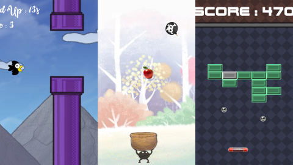
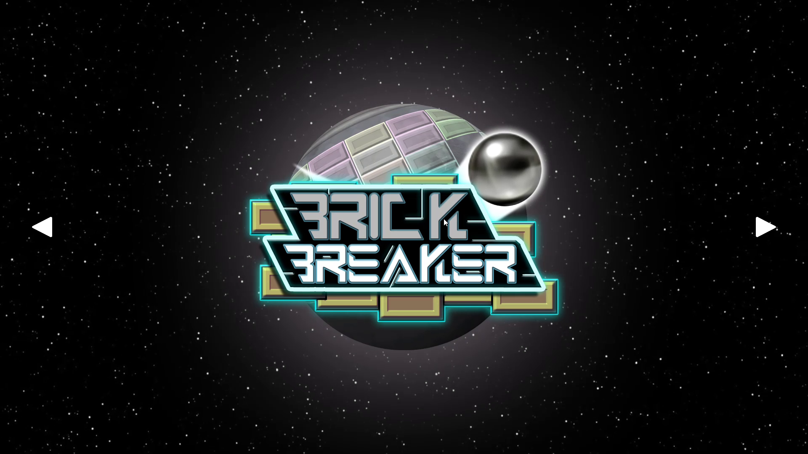
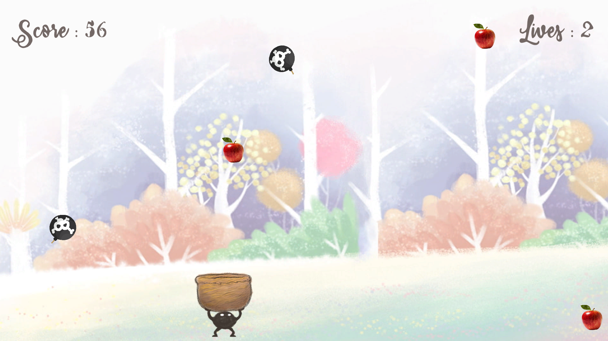
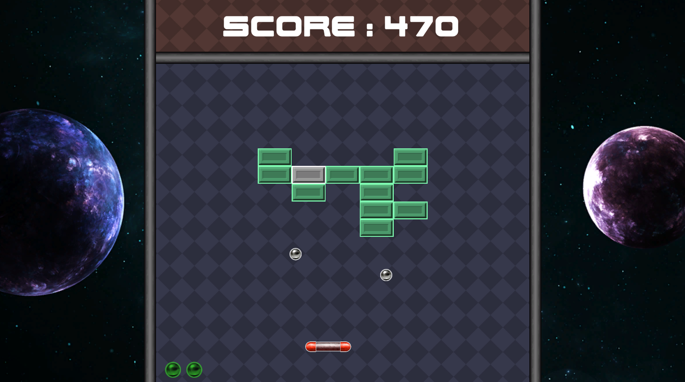
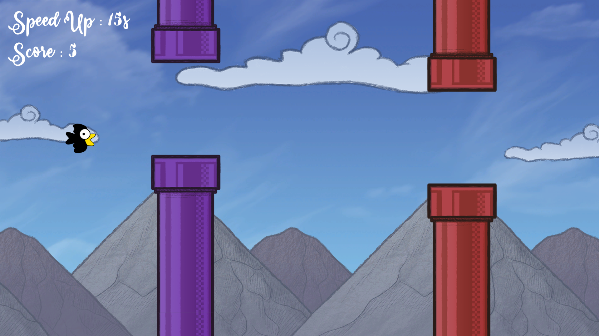

<!-- CREDITS -->
<!--
*** README template by othneildrew : https://github.com/othneildrew/Best-README-Template/blob/master/README.md?plain=1
*** Programming language badges by Ileriayo : https://github.com/Ileriayo/markdown-badges
-->

<!-- PROJECT LOGO -->

  

  <h3 align="center">LB2B_Minigames</h3>

  

    Unity development school project
  

## About the project

This app is a set of 3 mini-games made as a part of a Unity development class.

**Built with:**

### Screenshots

#### Main menu

#### Apple catcher

#### Brick Breaker (Breakout-style game)

#### Furapi Bird (Flappy Bird clone)

## Build intructions

1. Install **Unity Hub** and **Unity Editor 2022.3**
2. Clone the repository
3. In Unity Hub, click `Add` > `Add project from disk` and browse to the *UnityMinigames* directory
4. Open the project in the Unity Editor (if not done automatically)
5. In the Unity Editor, open the `File` menu and click on `Build settings` > `Build`

## Contributors

- Maxime Blanchard - https://github.com/maxime-bl
- Flavian Theurel - https://github.com/heosfx

(<a href="#readme-top">Back to the top</a>)
